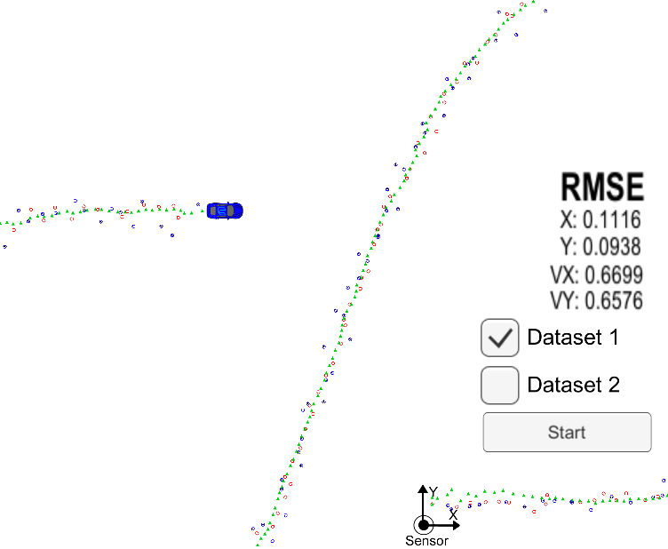

# Extended Kalman Filter

Implementation of a very simple Extended Kalman Filter.
Based on [starter code from Udacity course](https://github.com/udacity/CarND-Extended-Kalman-Filter-Project).

#### How to run

* Download 2D car simulator [here](https://github.com/udacity/self-driving-car-sim/releases)
* Install [uWebSocketIO](https://github.com/uWebSockets/uWebSockets)
* Install other deps
    * `cmake` >= 3.5
    * `make` >= 4.1
    * `gcc/g++` >= 5.4
* Build
    1. mkdir build
    2. cd build
    3. cmake ..
    4. make
* Run ``./ExtendedKF`
